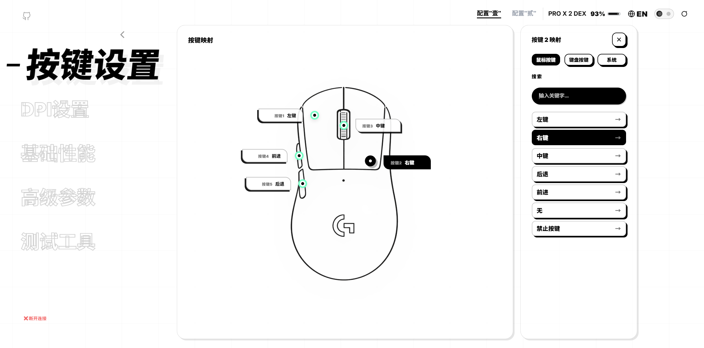
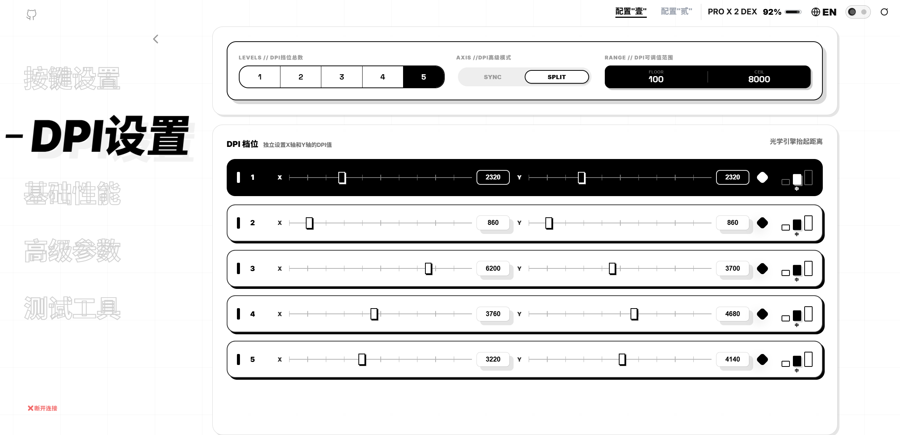
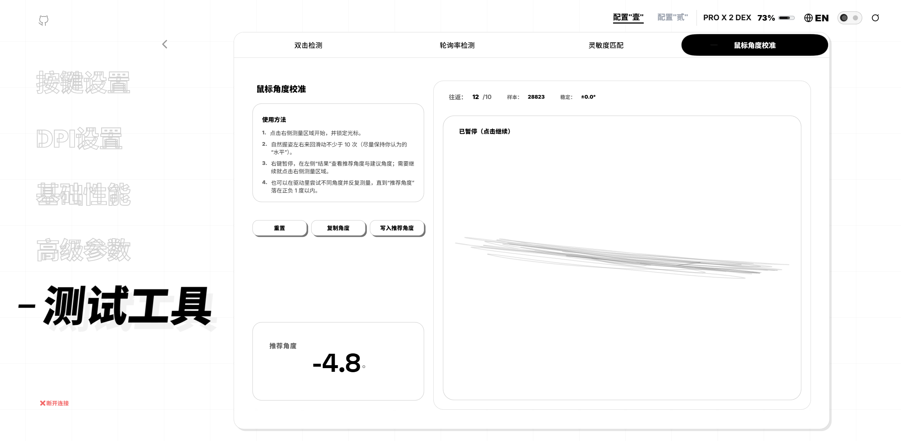

# Click Sync


> Click Sync 是一个基于 Web HID API 的鼠标网页驱动，旨在构建一个 **ALL IN ONE** 的鼠标网页驱动解决方案，支持多种品牌设备。无需安装任何驱动或软件，直接在浏览器中完成鼠标配置。
>
> Click Sync is a WebHID-based browser mouse driver built as an **ALL-IN-ONE** configuration console. Currently supported device families: Logitech, Rapoo, ATK, and Chaos.

当前实现覆盖品牌：`Logitech`、`Rapoo`、`ATK`、`Chaos`。  
Currently implemented brands: `Logitech`, `Rapoo`, `ATK`, `Chaos`.


## 🔗 体验链接
- 🌐 **网站**: https://nuitfanee.github.io/ClickSync.github.io/
- 🌐 **Beta网站**: https://xn--i8s54d9wak75j.xyz/







---

## 目录

- [背景](#背景)
- [功能特性](#功能特性)
- [UI 设计风格](#ui-设计风格)
- [支持的设备](#支持的设备)
- [浏览器要求](#浏览器要求)
- [快速开始](#快速开始)
- [用法](#用法)
- [项目结构](#项目结构)
- [架构说明（面向开发者）](#架构说明面向开发者)
- [开发调试工具：WebHID Workbench](#开发调试工具webhid-workbench)
- [常见问题](#常见问题)
- [贡献](#贡献)
- [主要维护者](#主要维护者)
- [开源协议](#开源协议)

---

## 背景

你是否也遇到过这样的烦恼？不同品牌的鼠标，要去记不同的官网、找不同的驱动网页——罗技一个、雷柏一个、ATK 一个、Chaos 又一个……记不住，找起来也麻烦。
Click Sync 就是为解决这个问题而生。它是一个全品牌通用的网页版鼠标配置中心，让你只需记住一个网址，就能在浏览器中直接管理多个品牌的鼠标设置。无需安装任何驱动或软件，打开即用，全面支持按键映射、DPI、灯光、高级参数设置等功能。
用一个工具，统一所有鼠标。

项目目标：

- **即开即用**：打开网页即可连接设备并配置（需在安全上下文 `https` / `localhost` 下使用）。
- **多设备类型适配**：按设备类型动态加载对应协议脚本，并通过适配器层统一 UI 与能力范围。
- **自动探测已授权设备**：页面空闲时会复用 `navigator.hid.getDevices()` 已授权句柄；插拔事件会触发自动重连探测。
- **配置 + 测试一体**：除常规配置外，内置双击检测、轮询率检测、灵敏度匹配、角度校准等工具页。

> 说明：WebHID 通常仅在桌面端 Chromium 系浏览器可用；移动端与部分浏览器可能不支持。

---

## 功能特性

### 核心配置

- **按键映射**：自定义鼠标按键功能映射（按键 → 动作/键值）。
- **DPI 设置**：支持 1–6 档 DPI（按设备能力裁剪，Logitech 默认 1–5 档）；可调整档位数量与每档数值。
- **基础性能**
  - 回报率（Polling Rate）：125 / 250 / 500 / 1000 / 2000 / 4000 / 8000 Hz（不同设备/固件可能限制可选项）
  - 双回报率（设备相关）：支持有线/无线独立回报率配置（如 Logitech：有线最高 1000Hz、无线最高 8000Hz）
  - 性能模式：低功耗 / 标准 / 竞技 / 超频（具体文案与可用项可由设备适配器覆盖）
- **配置槽位（设备相关）**：支持切换与同步配置槽位（如 Logitech Profile Slot）。
- **高级参数**（随设备/固件差异，UI 会自动裁剪不可用项）
  - 电源管理：休眠时间、按键防抖
  - 传感器调校：角度修正、手感/高度类参数（部分设备以“引擎高度”等方式呈现）
  - 功能开关：Motion Sync、直线修正（Linear/Angle Correction）、纹波抑制（Ripple Control）、玻璃模式（Glass Mode）等
  - 指示灯：DPI/接收器灯效（部分设备提供专属灯效设置）
  - LOD：抬起静默高度（Low/High）
  - Logitech 专属：板载内存模式、LIGHTFORCE（Optical/Hybrid）、Surface Mode（Auto/On/Off）、BHOP Delay（0–1000ms）
  - ATK 专属：DPI 灯效、接收器灯效、超远距离模式（Long Range Mode）

> 注：本项目以“语义配置项”组织功能，最终由协议层转换为设备寄存器/报文写入；README 中列举的高级项以代码中已实现的字段为准。

### 测试与校准工具

- **双击检测**：统计按下/抬起次数与时间间隔，用于诊断按键抖动/双击问题。
- **轮询率检测**：实时显示回报率相关指标，验证设备与链路表现。
- **灵敏度匹配**：帮助在不同鼠标之间对齐相同移动灵敏度，便于无缝切换。
- **角度校准**：用于轨迹拟合/角度锁定相关测试与校准。

---

## UI 设计风格

本项目 UI 采用 **Neo‑Brutalism（新野兽主义）** 设计语言，面向“硬件调试工具”场景强调清晰、强对比与可操作性。

- **High Contrast**：纯白/深黑为基色，高饱和电光紫/蓝作为强调色。
- **Hard Shadows**：厚重实体投影强化模块边界与“可点击”的物理感。
- **Grid Layout**：隐约网格线强调对齐、秩序与工具属性。
- **Bold Typography**：超粗标题 + 空心/实心字对比，强化层级与信息密度控制。
- **Tech‑Futuristic**：参数可视化（回报率/模式字节/原始数值）搭配开关与进度条，形成“极客实验室”氛围。
- **UX 亮点**：启动页“SYSTEM READY”仪式感与沉浸状态反馈；工具页布局整齐、数据直观。

视觉关键词：**Neo‑Brutalism · High Contrast · Bold Typography · Tech‑Futuristic · Grid Layout · Hard Shadows**

---

## 支持的设备

项目通过 **VID + Usage Page/Usage** 识别设备类型，并在发起 `navigator.hid.requestDevice()` 时合并过滤器（当前 `DEVICE_REGISTRY`：`Logitech / Rapoo / ATK / Chaos`）。

| 类型 | 识别规则（摘要） | VID | 过滤器（摘要） | 状态 |
|---|---|---:|---|---|
| Logitech | `vendorId=0x046d` 且存在 `usagePage=0xff00`（`usage=0x01/0x02` 或厂商集合） | `0x046d` | `usagePage=0xff00, usage=0x01/0x02`（并兼容 `usagePage=0xff00`） | ✅ |
| Rapoo（雷柏） | `vendorId=0x24ae` 且存在 `usagePage=0xff00` 的厂商集合 | `0x24ae` | `usagePage=0xff00, usage=14/15` | ✅ |
| ATK | `vendorId∈{0x373b,0x3710}` 且存在 `usagePage=0xff02, usage=0x0002` | `0x373b / 0x3710` | `usagePage=0xff02, usage=0x0002` | ✅ |
| Chaos | `vendorId=0x1915` | `0x1915` | 优先 `usagePage=0xFF0A`，兼容 `0xFF00` | ✅ |

> 计划：持续扩展更多鼠标品牌/型号；新增设备通常需要补充识别规则、协议实现与能力范围（见下文“架构说明”）。

---

## 浏览器要求

### ✅ 推荐

- Chrome / Edge（Chromium）89+（需支持 WebHID）

### ❌ 不支持 / 可能不支持

- Firefox、Safari、移动端浏览器及其它非 Chromium 内核浏览器（视实现而定）

> WebHID 还要求**安全上下文**：`https` 或 `http://localhost`。直接用 `file://` 打开通常不可用或体验不稳定。

---

## 快速开始

本项目为静态网页应用，无需构建依赖。

1. 克隆仓库或下载源码
2. 通过本地静态服务器启动（推荐，满足 WebHID 安全上下文要求）：

```bash
# 方式 A（不推荐，仅用于静态预览）：
# 直接使用 Chrome / Edge 打开 index.html（WebHID 通常不可用）

# 方式 B：Python
python -m http.server 8000

# 方式 C：Node.js（需已安装 node）
npx http-server . -p 8000
```

3. 打开页面：

- `http://localhost:8000/index.html`

---

## 用法

### 1）连接设备

1. 使用支持 WebHID 的桌面浏览器打开页面；
2. 在启动页点击触发区域（例如 “Hold to Initiate System”）或点击“连接/Connect”按钮；
3. 在浏览器弹窗中选择鼠标设备并授权；
4. 连接成功后进入主配置界面。

> 浏览器不会允许网页“静默自动连接”未授权设备；首次必须由用户在弹窗中手动选择并授权。
> 对已授权设备，页面会在空闲时自动探测；若检测到设备类型与当前选择不一致，会自动切换设备类型并刷新页面加载对应协议。

### 2）配置与测试

- **按键映射**：选择按钮位置 → 从动作列表中选择映射项。
- **DPI 设置**：调整档位数量与每档 DPI；界面变化会通过防抖队列合并写入，避免频繁下发。
- **基础性能**：回报率/性能模式等通过统一的“设备补丁队列”写入（合并多项变更为一次写入）。
- **高级参数**：不同设备会自动显示/隐藏不兼容项（Logitech / Rapoo / ATK / Chaos 各有差异）。
- **Logitech 进阶面板**：支持板载内存、LIGHTFORCE、Surface Mode、BHOP Delay、有线/无线回报率与配置槽位切换。
- **ATK 进阶项**：支持 DPI 灯效、接收器灯效、超远距离模式。
- **测试工具**：在工具页中运行双击/回报率/灵敏度/角度相关测试。

---

## 项目结构

> 下面列出核心文件，便于快速定位。

```
.
├── index.html                  # 主页面与 UI 结构
├── app.js                      # 应用层：连接流程、页面交互、配置读写与写入队列
├── device_runtime.js           # 设备识别与 WebHID 过滤器聚合；动态加载协议脚本
├── protocol_api_logitech.js    # Logitech 协议实现（HID++ 2.0 + Profile Stream + Planner/SPEC）
├── protocol_api_rapoo.js       # Rapoo 协议实现（分层：Driver/Codec/Planner/SPEC/API）
├── protocol_api_atk.js         # ATK 协议实现（分层：Driver/Codec/Planner/SPEC/API）
├── protocol_api_chaos.js       # Chaos 协议实现（非标准分层架构，大部分代码使用原驱动代码，代码水平低，较为混乱，如需扩展新设备请参考Rapoo、ATK协议实现）
├── refactor.js                 # 全局配置 + 设备适配器/写入策略 + UI Variant 应用
├── mouse-main.js               # 测试工具主逻辑
├── nav-match.js                # 灵敏度匹配工具
├── rotation-calibration.js     # 角度校准工具
├── style.css / theme.css       # 样式与主题
├── WebHID_Workbench.js         # Userscript 调试工作台（抓包/快照/复刻）
└── image/                      # UI 与鼠标示意图资源（UI1/UI2/UI3/UI5/UI4、GPW、GPW_DEX 等）
```

---

## 架构说明（面向开发者）

### 1）运行时识别与协议加载

- `device_runtime.js` 维护 `DEVICE_REGISTRY`（设备注册表），每个条目包含：
  - `match(device)`：识别规则（基于 `vendorId` 与 HID Collections 的 Usage Page/Usage）
  - `filters`：用于 `navigator.hid.requestDevice()` 的精确过滤器
- 用户授权后通过 `identifyDeviceType()` 判断设备类型；页面通过 `localStorage` 保存上一次选择（`device.selected`），并记录最近 HID 信息（`mouse.lastHid`）。
- `autoConnect()` / `connect()` 使用“优先类型 + 已授权设备集合”进行候选筛选；连接时会在候选列表中回退重试。
- `ensureProtocolLoaded()` 会按设备类型动态加载 `protocol_api_*.js`（含 `protocol_api_logitech.js`），并要求协议脚本导出 `window.ProtocolApi` 供上层使用。

### 2）写入队列与写入策略（避免频繁写设备）

- `app.js` 提供统一的 `enqueueDevicePatch(patch)`：把 UI 侧的多次变更合并到同一个防抖队列中，再一次性写入设备。
- `refactor.js` 抽离 `DeviceWriter.writePatch()`：根据设备不同选择不同写入策略（例如 Rapoo ATK 倾向逐项 `setFeature`；Chaos 设备会对 `modeByte` 相关字段做拆分/批写以保证状态一致性）。
- `refactor.js` 的 `actions` 映射支持设备专属命令入口（例如 Logitech 的 `setActiveProfileSlot / setOnboardMemoryMode / setLightforceSwitch / setSurfaceMode`），并与 `setBatchFeatures` 协同。
- `app.js` 在首次配置回包完成前会禁写（`__writesEnabled=false`），避免初始化阶段误写回设备。

### 3）协议实现的分层（以 `protocol_api_rapoo.js` 为例，如需扩展新设备请参考Rapoo、ATK协议实现；）
> Chaos大部分代码使用原驱动代码，较为混乱，切勿参考chaos

协议文件采用“可系统化扩展”的分层组织，核心思路是：**业务层不拼报文，协议知识集中到规范表与计划器**。
- **UniversalHidDriver**：传输层，只负责把命令送到设备
- **ProtocolCodec**：编码层，生成 A5A5 写 / A5A4 读指令
- **TRANSFORMERS**：转换层，语义值 → 协议值/字节数组
- **SPEC**：规范层（最关键）：每个语义配置项的 `validate / encode / plan / deps / priority`
- **CommandPlanner**：计划层：补齐依赖、排序、去重（last-write-wins），生成最终命令序列
- **MouseMouseHidApi**：对外 API：提供 `requestConfig()`、订阅 `onConfig/onBattery/onRawReport` 等能力

`protocol_api_logitech.js` 同样遵循 Driver/Codec/Planner/SPEC/API 分层，但编码为 HID++ 2.0 指令，并对 DPI/按键等修改走 Profile Stream 聚合写入（Start/Chunk/Commit + Ack 匹配）。

> 设计目标：新增/调整功能时，尽量只改动 `SPEC/TRANSFORMERS`，降低对上层业务与 UI 的侵入。

### 4）UI Variant（设备差异化呈现）

- `refactor.js` 提供 `DeviceAdapters`（纯数据：文案/范围/选项）与 `DeviceUI.applyVariant()`（按设备类型显示/隐藏控件、替换文案与范围）。
- 当前 Variant 已覆盖 `Logitech / Rapoo / ATK / Chaos`，包括 ATK 灯效循环区、Long Range 开关与 Logitech 专属高级列（`advancedLogitechColumn`）。
- 设备切换时会做“恢复/回滚”，避免不同设备的 UI 状态残留影响下一次渲染。

### 5）新增设备/协议的建议流程

1. 在 `device_runtime.js` 的 `DEVICE_REGISTRY` 中添加新设备类型：补充 `match()` 与 `filters`（尽量使用厂商集合的 Usage Page/Usage 进行精确过滤）。
2. 新增 `protocol_api_<brand>.js`：保证导出 `window.ProtocolApi`，并提供与现有 API 兼容的读写入口（例如 `setFeature / setBatchFeatures / requestConfig` 等）。
3. 在 `refactor.js` 的 `AppConfig.ranges` 与 `DeviceAdapters` 中补充该设备的能力范围、`keyMap/transforms/actions/features` 与文案（以及需要裁剪的 UI 项）。
4. 在 UI 层（`index.html` / `app.js`）补充必要的绑定与展示（优先走 `enqueueDevicePatch` + Writer 策略；设备专属面板请挂到 Variant 控制流）。

---

## 开发调试工具：WebHID Workbench

仓库内包含一个开发期使用的 **Userscript 工作台**：`WebHID_Workbench.js`。它会在目标网页中注入浮层面板，用于**采集 WebHID 往返报文、做快照、导出为 JSON，并支持按原始时序复刻已记录的 OUT 报文序列**，便于进行协议研究、兼容性验证与问题定位。

### 能做什么

- **自动捕获 WebHID 通信**：Hook `HIDDevice.sendReport / sendFeatureReport / receiveFeatureReport`，并监听 `inputreport` 事件，将报文记录到实时缓冲区与全量日志。
  方向标记包括 `OUT / IN / sendFeature / receiveFeature`。
- **快照机制（delta window）**：每次“捕获快照”仅保存“上一次快照之后新增”的报文段，避免日志过长难以定位。
- **导出 JSON**：导出内容包含设备 `vid/pid`，以及每个快照的编号、备注与格式化报文行（包含 `usagePage/usage`、方向、`ReportID` 与 Hex）。
- **按时序复刻快照中的 OUT 报文**：从快照中过滤 `dir === 'out'` 的报文，按记录的时间间隔重新发送；再次点击可停止。
- **可插拔解析规则**：内置 `PARSER_RULES`，可针对常见报文做快速识别/解码（如 DPI 表、按键映射、状态报告等），也可以自行添加规则。

### 安装与使用

1. 安装浏览器 Userscript 管理器（如 Tampermonkey / Violentmonkey）。
2. 导入脚本：`WebHID_Workbench.js`。
3. 打开脚本已配置的目标站点之一（脚本使用 `@match` 限定注入范围，例如：`hub.rapoo.cn`、`hub.atk.pro`、`rawmtech.com`、`mchose.com.cn`、`hub.miracletek.net`、`chaos.vin` 等）。
4. 在页面中连接设备并进行一次你关心的操作（例如修改 DPI/回报率/按键映射等），让页面产生通信报文。
5. 在右上角“⚡ WebHID 工作台”浮层中：
   - 点击 **📸 捕获快照**：为当前操作段打点（建议输入备注，如“DPI 改为 1600”）。
   - 点击 **💾 导出**：导出所有快照为 JSON 文件，便于后续离线分析与整理。  
   - 点击 **复刻操作**：将该快照内的 OUT 序列按原时序发送（用于复现特定行为/验证兼容性）。

### 使用建议

- 建议把一次“功能变更”拆成一个快照：**操作前清空缓冲区 → 操作 → 捕获快照 →（可选）导出**，这样更易对齐一次变更对应的报文段。
- 如需扩展快速识别能力，可在脚本顶部的 `PARSER_RULES` 中添加 `match/decode` 规则。
- 该脚本会注入到匹配域名页面并记录通信数据，**仅建议在可信环境下用于开发/测试**。


## 常见问题

### 为什么点了“连接”没有弹出设备选择窗口？

- 需要 **用户手势** 触发（点击/按键等）才能调用 `navigator.hid.requestDevice()`。
- 确认在 `https` 或 `http://localhost` 下打开；直接 `file://` 打开通常不满足安全上下文。
- 确认浏览器为 Chromium 系并启用了 WebHID（Chrome/Edge 89+）。

### 为什么页面会自动连接已授权设备，或自动切换设备类型？

- 页面初始化与设备插拔事件会触发 `autoConnect`，自动尝试连接 `navigator.hid.getDevices()` 返回的已授权设备。
- 如果实际识别出的设备类型与当前 `device.selected` 不一致，运行时会切换类型并刷新，以加载匹配的协议脚本与 UI Variant。

### Logitech 高级项为什么会被限制或自动恢复？

- Logitech 设备提供“板载内存模式”开关；关闭后，网页侧部分设置不保证可写入，UI 会给出确认提示。
- 连接阶段若检测到板载内存未开启，系统会按适配器策略自动尝试开启，确保后续设置可稳定写入。

### 设备能被系统识别，但列表里找不到？

- 本项目会带过滤器请求设备（VID + Usage Page/Usage），如果设备暴露的 HID 集合不匹配当前规则，可能会被过滤掉。
- 处理方式：在 `device_runtime.js` 中扩展该设备的 `filters/match()`（建议先打印 `device.collections` 观察 Usage Page/Usage）。

### 修改配置后没有写入设备？

- UI 变更会进入写入防抖队列；在连接成功并收到一次设备配置同步后，才会开启写入（避免“初始化状态”误写回设备）。
- 若写入失败，查看控制台日志（可能是设备未打开、权限丢失或协议不匹配）。

---

## 贡献

欢迎通过 Issue / PR 参与贡献：

- **新设备支持**：补充 `DEVICE_REGISTRY` 识别规则 + `protocol_api_xxx.js` + `refactor.js` 适配器（`ranges/keyMap/transforms/actions/features`）
- **新功能**：优先扩展 `SPEC/TRANSFORMERS`（协议层），再接入 UI
- **Bug 修复**：请提供复现步骤与设备信息（品牌/VID/固件版本/浏览器版本）

---

## 主要维护者

- [@Nuitfanee](https://github.com/Nuitfanee)

---

## 开源协议

本项目为开源项目。请查看仓库中的 `LICENSE` 文件。
